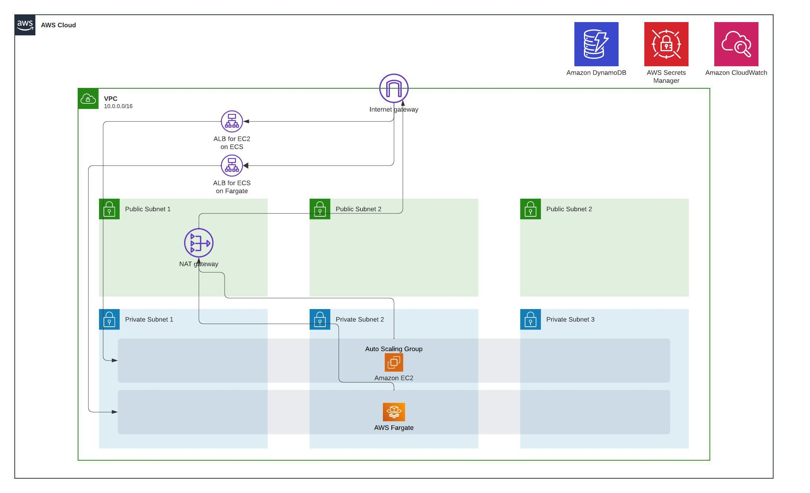

# AWS ECS Security Workshop

Repo contains resources created for demonstrating security features of AWS ECS. Originally created for the session titled "Securing Containerized Workloads on ECS" @ the August Monthly Meetup of AWS User Group - Colombo [31/08/2023]

Slide deck accompanying the session is also available within the repo

## Directory and File Specification

*python-api* - Sample python api which is deployed as an ECS task. The API service is a REST API written in Python that talks to a backend database using DynamoDB. Copied from https://github.com/aws-containers/ecsdemo-migration-to-ecs.git and did few minor modifications. Kudos to the original authors!

*infra* - Contains Terraform code for the sample infrastructure demonstrating security features of AWS ECS

*aws-architecture.jpg* - High Level AWS Architecture of the deployed solution via Terraform

*session-slide-deck-v*.pdf* - Session slide deck

## Notes (Read before orchestrating the infrastructure)

- **AWS Cloud9 is recommended for carrying out following actions.**
- **Infrastructure provisioned from running "terraform apply" within infra directory will incur costs. Ensure to run "terraform destroy" after testing these on your AWS accounts.**
- **Also enable AWS Budgets Alerts to notify you on AWS cloud bill passing a defined threshold.**

*python-api* 
- Build and push the Docker image from the given Dockerfile to your repository before creating ECS resources. Refer to notes under infra section below. 

*infra*

#### High Level AWS Architecture of the Deployed Solution

- Refer backend.tf and comment it out to use Terraform local state or replace it with your own Terraform cloud configs or use another backend provider.
- Setup aws-access-key and aws-secret-key on terraform.tfvars file or deploy this within a environment which has respective permissions to access resources specified within this directory. 
- If you are on AWS Cloud9, the IAM role attached to Cloud9 takes care of the AWS permissions and you won't have to setup AWS access separately.
- Ensure that contents within ecs.tf is commented out at the initial "terraform apply"
    - Then go to AWS Secrets Manager and add the secret value for DynamoDB-Table-Name. Default is UserTable
    - Log into the ECR registry you created
      - `aws ecr get-login-password --region us-east-1 | docker login --username AWS --password-stdin <aws-account-id>.dkr.ecr.us-east-1.amazonaws.com`
    - Tag the image with ECR repository name. You can view this by going to ECR service within AWS console.
      - `docker build -t <aws-account-id>.dkr.ecr.us-east-1.amazonaws.com/user-api:latest .`
    - Push the image to the created ECR repository
    - Uncomment the content in ecs.tf
      - `docker push <aws-account-id>.dkr.ecr.us-east-1.amazonaws.com/user-api:latest`
    - Run "terraform apply" again.

## API Access Curl Commands

- `curl http://<alb-dns>/all_users`
- `curl -s 'http://<alb-dns>/user/?first=Rajesh&last=Koothrappali'`